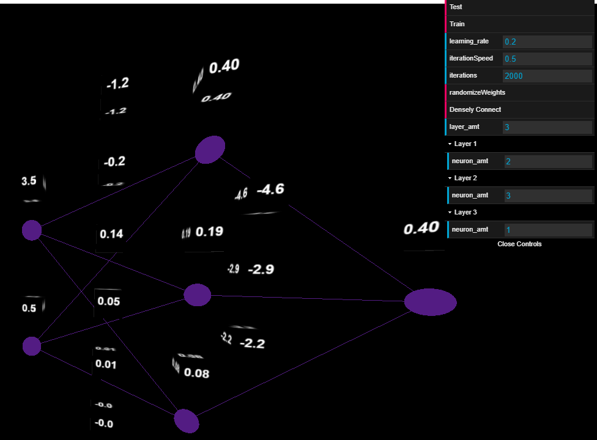

# 3js-nn-visualizer
Visualize a simple feed forward neural network with arbitrary amount of hidden layers

Hopefully, it's a pretty straight forward project to understand!

This project is for those who know javascript, but want to get into neural networks without learning a different language.
Additionally, at least for me, it's always neat to see what you're making visually!

Here are resources I used to learn about neural networks:
https://docs.google.com/document/d/1EE_A1qRasCy7E73VVu_LoewYd4wRa9GtmbSlP5J9k7A/edit?usp=sharing

## Getting Started

1) Download and unzip the three.js library: https://github.com/mrdoob/three.js/archive/master.zip

2) Place the three.js library folder in your top most directory (this is where the package.json is)

3) From the top most directory run "npm install", to install typescript related modules.
Run "npm run watch" if you want to modify the index.ts file (I will probably turn the whole thing into typescript, we'll see)

4) To run this project I use Visual Studio Code Extension called "Live Server"
Link: https://marketplace.visualstudio.com/items?itemName=ritwickdey.LiveServer

It's a great way get this thing running fast.

Contact me at ty@tyfoodsforthought.com if you want to reach out to me!

### Prerequisites

1) Typescript- Node.JS
2) Three.JS
3) Live Server VScode Extension (Optional, but necessary for quick start)

## Authors

* **Ty Roachford** - [Tyfoods Github](https://github.com/Tyfoods)

See also the list of [contributors](https://github.com/Tyfoods/3js-nn-visualizer/graphs/contributors) who participated in this project.

## License

This project is licensed under the MIT License - see the [LICENSE.md](LICENSE.md) file for details

## Acknowledgments

* Big thanks to all the amazing resources I used to make this project possible. Here I will again list the resources I used:
https://docs.google.com/document/d/1EE_A1qRasCy7E73VVu_LoewYd4wRa9GtmbSlP5J9k7A/edit?usp=sharing

