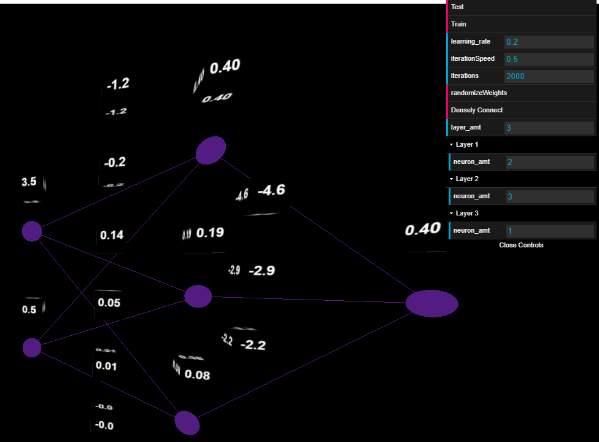

# 3js-nn-visualizer
Visualize a simple feed forward neural network with arbitrary amount of hidden layers

Hopefully, it's a pretty straight forward project to understand!

This project is for those who know javascript/typescript, but want to get into neural networks without learning a different language.
Additionally, at least for me, it's always neat to see what you're making visually!

Here are resources I used to learn about neural networks:
https://docs.google.com/document/d/1EE_A1qRasCy7E73VVu_LoewYd4wRa9GtmbSlP5J9k7A/edit?usp=sharing

## Getting Started

1) git clone https://github.com/Tyfoods/3js-nn-visualizer.git

2) Navigate to the folder containing the project

3) From the top most folder (i.e. root directory), open terminal and run `npm install`

4) To run this project: Run `npm run dev`, which is accesible locally with this link - http://localhost:5173/ (5174, or 5175 etc... if port is already taken! Just check your logs after running `npm run dev` for the precise link)

Contact me at ty@tyfoodsforthought.com if you want to reach out to me!

### Prerequisites

1) Typescript/Javscript Knowledge
2) Node.JS
3) Curiosity

## Authors

* **Ty Roachford** - [Tyfoods Github](https://github.com/Tyfoods)

See also the list of [contributors](https://github.com/Tyfoods/3js-nn-visualizer/graphs/contributors) who participated in this project.

## License

This project is licensed under the MIT License - see the [LICENSE.md](LICENSE.md) file for details

## Acknowledgments

* Big thanks to all the amazing resources I used to make this project possible. Here I will again list the resources I used:
https://docs.google.com/document/d/1EE_A1qRasCy7E73VVu_LoewYd4wRa9GtmbSlP5J9k7A/edit?usp=sharing

